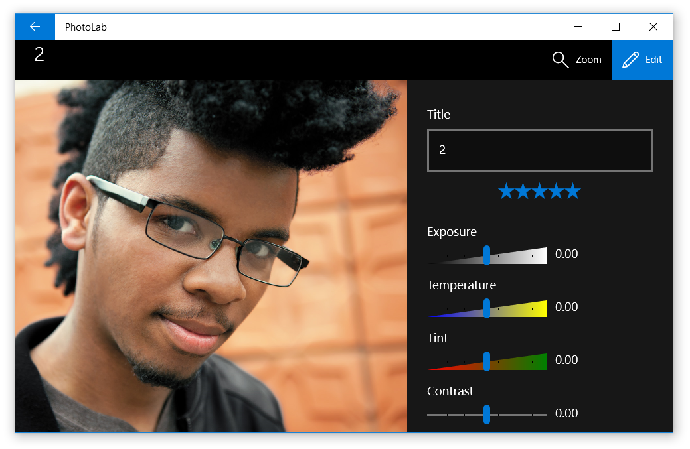

# QUIZ 1 PBKK

| Nama              | NRP        |
| ----------------- | ---------- |
| M. Armand Giovani | 5025211054 |

## Deskripsi Aplikasi PhotoLab
    Aplikasi Photolab dibuat menggunakan UWP (Universal Windows Platform). UWP merupakan teknologi pengembangan dalam kerangka NET yang mempermudah pengembang untuk menciptakan aplikasi yang dapat berjalan di berbagai jenis perangkat, seperti PC Windows, tablet, dan smartphone. Dalam aplikasi ini, pengguna dapat menelusuri koleksi foto, membuka dan memperbesar gambar, serta mengedit berbagai elemen seperti judul, rating, serta pengaturan exposure dan saturasi, dan lain sebagainya.

# PhotoLab sample

